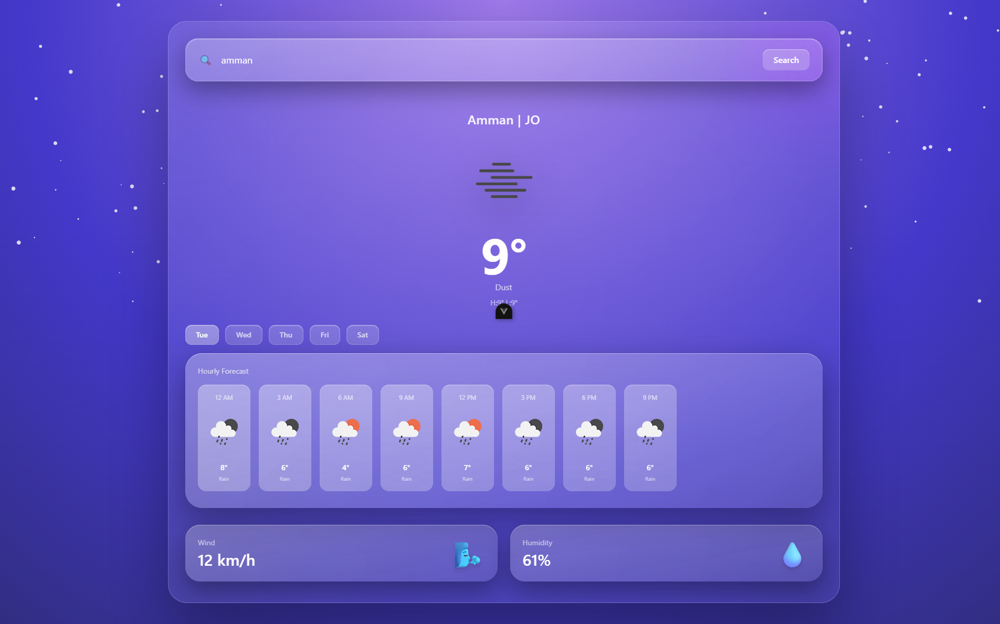
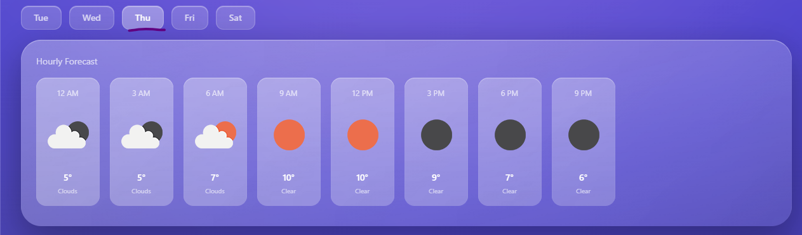

# 🌤️ Weather Forecast App (Vue 3)

A modern and visually rich **Weather Forecast application** built with **Vue 3 (Composition API)**. The app allows users to search for any city and view **current weather**, **hourly forecast**, and a **multi-day forecast**, all powered by the **OpenWeatherMap API**.

The UI focuses on a glassmorphism style with smooth transitions and responsive layouts.

---

## 📸 UI Preview

### Main Weather Dashboard



---

### Hourly Forecast View


---

### Daily Forecast Selector



---

## ✨ Features

* 🔍 Search weather by city name
* 🌡️ Displays current temperature, condition, high & low
* 🕒 Hourly weather forecast
* 📅 Multi-day forecast with day selector
* 💨 Extra weather details (wind speed & humidity)
* 🎨 Modern glassmorphism UI
* ⚡ Smooth UI transitions and responsive layout

---

## 🛠️ Tech Stack

* **Vue 3**
* **Composition API**
* **OpenWeatherMap API**
* **Fetch API**
* **Tailwind CSS**

---

## 🌐 API Usage

This project uses the **OpenWeatherMap API**:

* **Current Weather API**
* **5-Day / 3-Hour Forecast API**

> You will need your own API key from OpenWeatherMap.

---

## 📂 Project Structure

```bash
src/
├── App.vue
├── main.js
└── assets/
```

---

## 🚀 Installation & Setup

### 1️⃣ Clone the repository

```bash
git clone https://github.com/your-username/weather-app-vue.git
cd weather-app-vue
```

---

### 2️⃣ Install dependencies

```bash
npm install
```

---

### 3️⃣ Add your API key

Replace the API key inside your component:

```js
const API_KEY = "YOUR_API_KEY_HERE"
```

---

### 4️⃣ Run the development server

```bash
npm run dev
```

The app will be available at:

```
http://localhost:5173
```

---

## 🧠 How It Works

### 🔹 Data Flow

1. User searches for a city
2. Current weather data is fetched first
3. Forecast data is fetched after successful current weather response
4. Forecast results are grouped by day
5. Selecting a day updates the hourly forecast

---

### 🔹 State Management

* `header` → current weather data
* `cards` → wind & humidity info
* `forecastByDay` → grouped daily forecast
* `hours` → hourly forecast for selected day
* `selectedDay` → active forecast day

---

## ⏱️ Date & Time Formatting

* Hourly forecast uses localized 12-hour format
* Daily forecast shows weekday names

---

## ⚠️ Error Handling

* Empty input → no request sent
* Invalid city name → user alert
* State resets on failed request

---

## 📌 Notes

* Clean separation between current weather and forecast data
* Uses native `fetch` (no extra HTTP libraries)
* Optimized to avoid unnecessary API calls
* Ideal for learning:

  * API handling in Vue
  * State-driven UI updates
  * Composition API patterns

---

## 🧑‍💻 Author

**Mohammad Almashaikh**

---

## 📄 License

This project is open-source and available under the **MIT License**.
